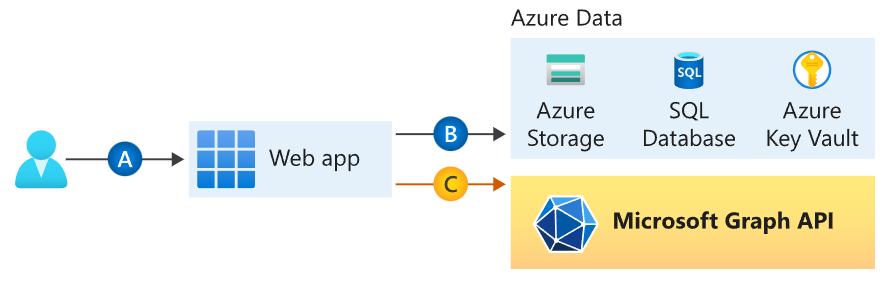
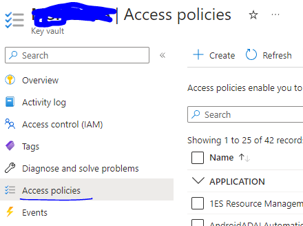

# App Service

This sample showcases the [App Service source](https://learn.microsoft.com/en-us/azure/app-service/) and how to acquire a secret from an [Azure Key Vault](https://vault.azure.net) using Azure Managed Identity  
We will cover [Azure Functions](https://learn.microsoft.com/en-us/azure/azure-functions/create-first-function-vs-code-other?tabs=go%2Cwindows) and how they can be used to return a token from the key vault

## Topology



### Scenario

Access an Azure Key Vault secret from a function deployed in Azure without managing secrets or app credentials.

## How To Run This Sample

To run this sample, you'll need:

- An IDE of your choice, for example [Visual Studio Code](https://code.visualstudio.com/download)
- An Internet connection
- An Azure account to create, deploy, and manage applications. If you do not have an Azure Account, follow the [instructions](https://azure.microsoft.com/free/) to get a free account.

### Step 1: Create & Publish your function

[Create and deploy your function](https://learn.microsoft.com/en-gb/azure/azure-functions/create-first-function-vs-code-other?tabs=go%2Cmacos) using an IDE of your choice, for example Visual Studio Code

This will give you a bare bones ***handler.go*** function

### Step 2:  Modify the Key Vault URI and Secret name values in the handler code

- Firstly, copy the following function into your ***handler.go*** file

```go
func getSecretFromAzureVault() string {
keyVaultUri := "your-key-vault-uri"
secretName := "your-secret-name"

miClient, err := mi.New(mi.SystemAssigned())

if err != nil {
  log.Printf("failed to create a new managed identity client: %v", err)
}

source, err := mi.GetSource()

if err != nil {
  log.Printf("failed to get source: %v", err)
}
fmt.Println("Managed Identity Source: ", source)

accessTokenR, err := miClient.AcquireToken(context.Background(), "https://vault.azure.net")
if err != nil {
  log.Printf("failed to acquire token: %v", err)
}

// Create http request using access token
url := fmt.Sprintf("%ssecrets/%s?api-version=7.2", keyVaultUri, secretName)

// Create a new HTTP request
req, err := http.NewRequest("GET", url, nil)
if err != nil {
  log.Printf("Error creating request: %v", err)
}

// Set the authorization header
req.Header.Set("Authorization", fmt.Sprintf("Bearer %s", accessTokenR.AccessToken))

// Send the request
client := &http.Client{}
resp, err := client.Do(req)
if err != nil {
  log.Printf("Error sending request: %v", err)
}
defer resp.Body.Close()

// Read the response body
body, err := io.ReadAll(resp.Body)
if err != nil {
  log.Printf("Error reading response body: %v", err)
}

// Combine all received buffer streams into one buffer, and then into a string
var parsedData map[string]interface{}
if err := json.Unmarshal(body, &parsedData); err != nil {
  log.Fatalf("Error parsing JSON: %v", err)
}

// Print the response body
return fmt.Sprintf("The secret from Object , %s, has a value of: %s", secretName, parsedData["value"])
}
```

- Modify the following to your corresponding ***keyVaultUri*** and ***secretName***

```go
keyVaultUri := "your-key-vault-uri"
secretName := "your-secret-name"
```

- You will also want to modify the existing ***helloHandler*** function to match this

```go
func helloHandler(w http.ResponseWriter, r *http.Request) {
  fmt.Fprint(w, getSecretFromAzureVault())
}
```

The following are the changes you need to make, using our sample function as an example:

- You can view our sample [handler.go](handler.go) file for reference
- If you are unsure where to get the required values, here are some details

1. **Key Vault URI** - In your Azure home page, go to your key vault, on the Overview page our key vault URI can be found under **'Essentials'**
1. **Secret Name** - On the Key Vault Overview page, go to the Panel on the left and expand the **'Objects'** dropdown  
Click into **'Secrets'**  
Click into the secret you want to use  
Click ont the version you would like to use  
Copy the part after the key vault URI and use that as your secret name  

## After you deploy the sample to Azure

There are few important settings you need to change for this sample to work:

### Enable managed identity on the function

- After you publish the function to Azure, go to your resource in the [Azure Portal](https://portal.azure.com/)
- Select the `Identity` blade of the function
- [Enable the System Assigned managed identity](https://learn.microsoft.com/azure/azure-functions/functions-identity-access-azure-sql-with-managed-identity#enable-system-assigned-managed-identity-on-azure-function) of the resource.

### Assign Azure roles using the Azure portal

Azure role-based access control (Azure RBAC) is the authorization system you use to manage access to Azure resources. To grant access, you assign roles to users, groups, service principals, or managed identities at a particular scope. This [article](https://learn.microsoft.com/azure/role-based-access-control/role-assignments-portal) describes how to assign roles using the Azure portal.

You will need to authorize the managed identity resource to access the vault.



## Launch the function

From the Azure portal you can access your function
Inside the function will be a ***Functions*** section that will contain your deployed function, in our example it will be called
***httptrigger1***

Enter into ***httptrigger1*** and click **Test/Run**
It will open a side bar where you can press the **Run** button
You should see a result come back for your key vault secret

> **Note**
> Did the sample not work for you as expected? Did you encounter issues trying this sample? Then please reach out to us using the [GitHub Issues](https://github.com/Azure-Samples/msal-managed-identity/issues) page.
